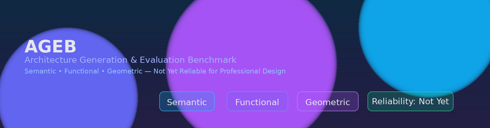

<p align="center">
  
</p>

<h1 align="center">AGEB: Architecture Generation and Evaluation Benchmark</h1>

<p align="center">
  <a href="https://github.com/torfqy/Architecture-Generation-and-Evaluation-Benchmark-AGEB-/stargazers"></a>
  <a href="https://github.com/torfqy/Architecture-Generation-and-Evaluation-Benchmark-AGEB-/issues"></a>
  <a href="https://github.com/torfqy/Architecture-Generation-and-Evaluation-Benchmark-AGEB-/blob/main/LICENSE"></a>
</p>

> LLMs are **not yet reliable** for generating architectural design images. AGEB provides a domain-grounded, automated benchmark to measure semantic fidelity, functional adequacy, and geometric consistency.

## 🧠 Method Overview
<p align="center">
  
</p>

## ✨ Highlights
- Unified, automated **benchmarking pipeline** for architectural text-to-image systems
- Three pillars: **Semantic (COT)** · **Functional (Circulation)** · **Geometric (Perspective)**
- Reproducible **orchestrator** + analysis scripts to aggregate results
- Clear **reliability finding**: not yet reliable under professional constraints

## 📦 Repository Structure
```
ageb/
├── assets/
│   ├── banner.svg
│   └── workflow.png
├── configs/
├── docs/
├── requirements.txt
├── src/
│   ├── orchestrator.py
│   ├── perspective_analysis.py
│   ├── circulation_analysis.py
│   ├── create_* / fix_* / generate_* utilities
│   └── analysis/
│       └── comprehensive_analysis.py
└── README.md
```

## 🚀 Quick Start
```bash
python3 -m venv .venv
source .venv/bin/activate
pip install -r requirements.txt
python src/orchestrator.py
```

## 🔬 Reproduction Steps
1. Prepare model outputs (images/metadata) and set paths in `src/orchestrator.py`
2. Run submodules if needed:
   ```bash
   python src/perspective_analysis.py
   python src/circulation_analysis.py
   ```
3. Aggregate and export figures/tables:
   ```bash
   python src/analysis/comprehensive_analysis.py
   ```

## 📊 Key Finding
> Under a unified evaluation, current LLM-based text-to-image systems are **not yet reliable** for architectural design image generation.

## 📄 Citation
If you use AGEB, please cite the paper (to appear).

## 📜 License
Apache 2.0. See the [LICENSE](../LICENSE) file.
